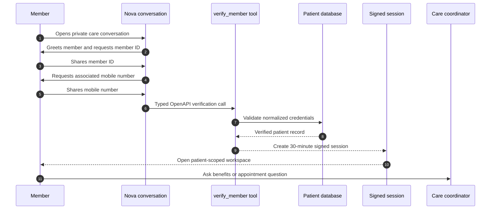
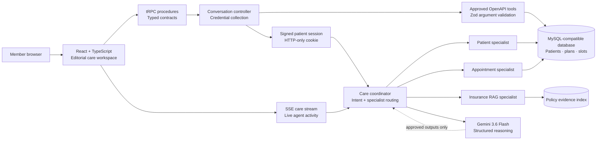

# NovaCorp Health Care Workspace

> **Private member access. Evidence-led coordination. Human-centred care.**

### Technology constellation

[](https://skillicons.dev)

[](https://trpc.io/)
[](https://orm.drizzle.team/)
[](https://ai.google.dev/)
[](https://www.openapis.org/)
[](https://render.com/)

NovaCorp Health is an enterprise-ready member-care workspace. It pairs an **AI-led access conversation** with a persistent multi-patient data model, policy-evidence retrieval, confirmation-gated appointments, and guarded Gemini reasoning. The product is designed so that the server—not the model or browser—owns verification, patient identity, data access, and consequential actions.

## Product at a glance

| Capability | What it delivers |
|---|---|
| **Conversation-first access** | Nova greets the member, requests a member ID, then asks for the associated mobile number. |
| **Patient-scoped session** | A signed, HTTP-only session is issued only after the backend verifies both credentials. |
| **Specialist routing** | Gemini classifies care requests for Patient, Insurance, Appointment, and Summary specialists. |
| **Grounded coverage support** | Policy answers use retrieved evidence with document, section, page, and relevance details. |
| **Action safeguards** | Booking and cancellation need a separate, explicit confirmation before server execution. |
| **Stateless deployment** | Persistent data lives in MySQL-compatible storage; the Node service is ready for Render. |

---

## The member journey



> **Trust boundary:** Nova guides the conversation, but the server validates credentials and creates the session. Gemini never authenticates a member, chooses a patient, or directly executes an appointment action.

---

## System architecture



### Guardrails by design

| Boundary | Enforcement |
|---|---|
| **Identity** | The verified patient ID is resolved from the signed server session, never accepted from a model or action payload. |
| **Tool use** | Operations are allowlisted, described by OpenAPI 3.1, and validated with Zod before execution. |
| **Evidence** | A response selecting policy evidence must include matching citations; no-evidence requests produce no policy conclusion. |
| **Appointments** | A displayed slot does not create an appointment. The member must explicitly confirm before the server calls the booking operation. |
| **LLM output** | Gemini receives approved, patient-scoped outputs only. Structured results are checked before the member sees them. |

---

## Technology stack

| Layer | Technologies | Responsibility |
|---|---|---|
| **Experience** | React 19, TypeScript, Tailwind CSS, shadcn/ui | Responsive member conversation and care workspace. |
| **Application server** | Node.js, Express 4, tRPC 11 | Typed APIs, server-sent activity events, session-bound orchestration. |
| **Data** | MySQL-compatible database, Drizzle ORM | Multi-patient records, medications, allergies, availability, and appointments. |
| **AI** | Google Gemini 3.6 Flash, JSON schemas | Specialist intent classification and constrained response composition. |
| **Contracts** | OpenAPI 3.1, Zod | Documented operations and runtime validation. |
| **Deployment** | Render Blueprint, health endpoint, environment configuration | One stateless Node service with persistent database backing. |

---

## Conversation and verification contract

Nova uses a deliberate two-step state machine. The sequence is predictable, inspectable, and easier to secure than interpreting a free-form identity statement.

```text
awaiting_member_id
        │ member ID captured
        ▼
awaiting_phone
        │ typed verify_member operation succeeds
        ▼
verified → signed session issued → workspace opens
```

The `verify_member` operation is included in the generated OpenAPI contract. It normalizes the member ID and mobile number, compares the server-side phone hash, returns a generic failure when validation does not succeed, and creates no patient session on its own. The conversation controller creates the session only after receiving a verified result.

---

## Quick start

### 1. Install and run

```bash
pnpm install
pnpm dev
```

### 2. Migrate and seed

```bash
pnpm drizzle-kit generate
# Apply the generated migration through the configured database migration flow.
pnpm seed:demo
```

### 3. Validate

```bash
pnpm test
pnpm check
pnpm build
```

## Showcase member credentials

| Member | Member ID | Mobile number |
|---|---|---|
| Avery Carter | `NCG-48219` | `555-010-4821` |
| Maya Singh | `NCG-91577` | `555-010-9157` |
| Jordan Brooks | `NCS-76064` | `555-010-7606` |

## Environment configuration

| Variable | Used for |
|---|---|
| `DATABASE_URL` | MySQL-compatible patient-care database connection. |
| `JWT_SECRET` | Signing short-lived, verified patient sessions. |
| `GEMINI_API_KEY` | Server-only Gemini API access for external hosting. |
| `GEMINI_MODEL` | Optional Gemini model override; defaults to `gemini-3.6-flash`. |

Never commit environment values or expose them through client-side code.

## Deploy to Render

The included [`render.yaml`](render.yaml) configures a stateless Node web service using `pnpm render-build`, `pnpm start`, and the `/health` check. Attach a persistent MySQL-compatible database, configure the server-only values above, apply the migration, then run `pnpm seed:demo` for the showcase data.

The project uses the Gemini `generateContent` API for its external server-side adapter and follows the application-managed function-calling pattern documented by Google. [1] [2]

## Project map

| Path | Purpose |
|---|---|
| `client/src/pages/Home.tsx` | Conversation-led member verification and patient workspace experience. |
| `server/novacorp/memberVerification.ts` | Verification conversation state machine and typed `verify_member` operation. |
| `server/novacorp/coordinator.ts` | Gemini intent routing, specialist orchestration, response validation, and fallback behavior. |
| `server/novacorp/tools.ts` | Patient-scoped approved operation dispatcher. |
| `server/novacorp/openapi.ts` | OpenAPI 3.1 contract and compatible model-tool definitions. |
| `server/novacorp/gemini.ts` | Direct external Gemini adapter with structured-response handling. |
| `drizzle/schema.ts` | Persistent multi-patient schema. |
| `docs/deployment.md` | External hosting, database, and Gemini deployment guide. |

## References

[1] [Google Gemini API — generateContent](https://ai.google.dev/api/generate-content)

[2] [Google Gemini API — function calling](https://ai.google.dev/gemini-api/docs/function-calling)
