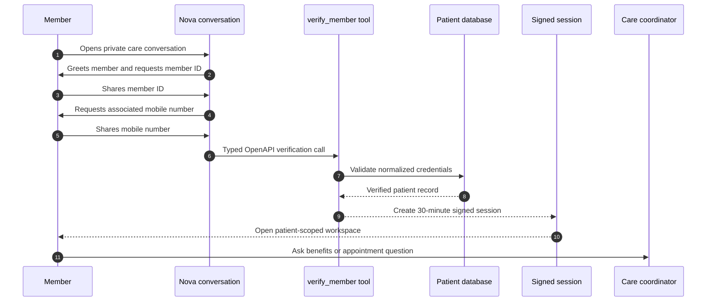
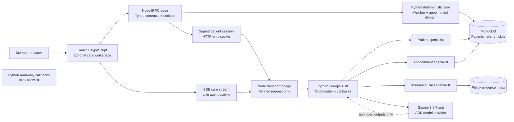

# NovaCorp Health Care Workspace

> **Private member access. Evidence-led coordination. Human-centred care.**

### Technology constellation

[](https://skillicons.dev)

[](https://trpc.io/)
[](https://www.mongodb.com/)
[](https://adk.dev/)
[](https://www.openapis.org/)
[](https://render.com/)

NovaCorp Health is an enterprise-ready member-care workspace. It pairs an **AI-led access conversation** with a persistent multi-patient data model, policy-evidence retrieval, confirmation-gated appointments, and a guarded **Python Google ADK** runtime. The product is designed so that the deterministic Python core—not the model or browser—owns verification, patient identity, MongoDB data access, and consequential actions.

## Product at a glance

| Capability | What it delivers |
|---|---|
| **Conversation-first access** | Nova greets the member, requests a member ID, then asks for the associated mobile number. |
| **Patient-scoped session** | The Node edge issues a signed, HTTP-only session only after the deterministic Python core verifies both credentials. |
| **Python-first care core** | Python owns member verification, registration, profile/card services, MongoDB reads, and confirmation-gated appointment transactions. |
| **ADK care coordination** | A separately guarded Python Google ADK runtime invokes only patient, evidence, and availability read callbacks for verified requests. |
| **Grounded coverage support** | Policy answers use retrieved evidence with document, section, page, and relevance details. |
| **Action safeguards** | Booking and cancellation need a separate, explicit confirmation before server execution. |
| **Stateless deployment** | Persistent data lives in MongoDB; per-request Python core and ADK processes never become an authorization store. |
| **Voice session control** | Members can speak naturally, see Nova’s spoken messages in the transcript, and end a voice session without leaving microphone capture active. |
| **Healthcare-first interface** | Nova’s assistant surfaces use heart-pulse iconography rather than generic AI sparkle marks. |
| **Natural access guidance** | Deterministic intent and credential checks protect access, while a credential-free Python ADK clarifier can phrase non-sensitive retry guidance more naturally. |
| **Permanent member enrollment** | New members provide name, date of birth, mobile number, and postal address; MongoDB stores the profile and issues a unique `NCM-` member ID. |
| **Member card services** | Every registered member receives a persistent digital healthcare ID card, while verified existing members can create one on demand. |
| **Self-service profile care** | Both newly registered and existing verified members can update their name, mobile number, date of birth, and postal address. |
| **Lost-card replacement** | A verified member can submit a persistent replacement request; a pending request is reused rather than duplicated. |

---

## The member journey



> **Trust boundary:** Nova guides the conversation, but the server validates credentials and creates the session. Gemini never authenticates a member, chooses a patient, or directly executes an appointment action.

---

## System architecture



### Guardrails by design

| Boundary | Enforcement |
|---|---|
| **Identity** | The Node edge resolves the signed session; the Python core revalidates its patient subject and never accepts a browser- or model-selected patient. |
| **Domain operations** | Python performs deterministic verification, registration, profile/card actions, and appointment transactions. Node retains only tRPC validation, cookie handling, and forwarding. |
| **Evidence** | A response selecting policy evidence must include matching citations; no-evidence requests produce no policy conclusion. |
| **Appointments** | A displayed slot does not create an appointment. Node requires explicit confirmation and the Python core transaction rechecks it before changing a slot or appointment. |
| **ADK callbacks** | Python `before_model` and `before_tool` callbacks require trusted patient state and reject non-allowlisted operations. |
| **Model output** | ADK responses are checked for citations, unsupported coverage language, diagnosis, and autonomous appointment claims before the member sees them. |

---

## Technology stack

| Layer | Technologies | Responsibility |
|---|---|---|
| **Experience** | React 19, TypeScript, Tailwind CSS, shadcn/ui | Responsive member conversation and care workspace. |
| **Application boundary** | Node.js, Express 4, tRPC 11 | Browser delivery, typed request validation, SSE activity events, HTTP-only signed sessions, and request-scoped forwarding to Python. |
| **Domain and data core** | Python 3, PyMongo, MongoDB | Deterministic member identity, profiles, cards, patient workspaces, evidence/availability reads, and MongoDB appointment transactions. |
| **AI runtime** | Python 3, Google ADK, Gemini 3.6 Flash | Separately guarded care orchestration, typed read-only callbacks, and grounded response composition. |
| **Contracts** | OpenAPI 3.1, Zod | Documented operations and runtime validation. |
| **Deployment** | Docker, Render Blueprint, health endpoint, environment configuration | One stateless Node + Python service with persistent database backing. |

---

## Conversation and verification contract

Nova uses a deliberate two-step state machine. The Python core owns the sequence, so it is predictable, inspectable, and easier to secure than interpreting a free-form identity statement.

```text
awaiting_member_id
        │ member ID captured
        ▼
awaiting_phone
        │ typed verify_member operation succeeds
        ▼
verified → signed session issued → workspace opens
```

The `verify_member` operation is included in the generated OpenAPI contract. The deterministic Python core normalizes the member ID and mobile number, compares the MongoDB phone hash, and returns a generic failure when validation does not succeed. Node creates the signed HTTP-only session only after receiving the verified Python response; Python never accepts a patient ID supplied by the browser.

Nova does not treat every unrecognized voice transcript as a mobile-number mistake. Before verification, a deterministic intent layer recognizes direct requests for a live agent, common speech-to-text variations of ending the session, and repeated unusable member-ID entries. It stops the active voice capture for terminal outcomes, ends the signed verification state, and shows the live-agent handoff after three failed access attempts. For non-terminal clarification only, the Node transport asks a dedicated **Python Google ADK** clarifier to phrase a short response from a safe intent label, stage, and remaining-attempt count. The model receives no raw speech, member ID, mobile number, patient data, or authority to choose the next security state; a deterministic safe fallback is used whenever the model is unavailable.

### Access reliability checks

Use the following development checks to exercise the pre-verification conversation. The result must be terminal for an explicit handoff or closing request: voice capture stops, no listening restart is scheduled, and the access interface no longer accepts another credential submission.

| Test input | Expected protected outcome |
|---|---|
| `Connect me to living` or “connect me to a human agent” | Nova recognizes the request as live-agent handoff, ends verification, and presents the connection state. |
| `Jesse de session`, `enges session`, “end my session,” or “I don't” | Nova recognizes a fuzzy transcript or natural closing phrase, ends verification, and stops voice capture. |
| `6001` → `sí sí sí hermano` → `sí 69` | Each unusable member ID increments the bounded access counter. After the third entry, Nova ends the access session and directs the member to a live agent. |
| A malformed ID that is not phone-like | Nova uses a member-ID-specific clarification rather than incorrectly describing it as a mobile-number error. |

These checks affect only the pre-verification conversation. A valid existing member still enters the normal member-ID-then-mobile sequence, and a new member can instead open the enrollment page to receive their first permanent ID.

---

## Member enrollment and self-service

New visitors can select **New to NovaCorp? Create a healthcare ID** from the member-access conversation. Enrollment collects the member’s **full name, date of birth, mobile number, postal address**, and optional second address line. The server normalizes and hashes the submitted mobile number, writes the profile to the `patients` MongoDB collection, generates a collision-resistant numeric `NCM-` member ID, issues a digital card, and opens the signed member session.

Existing verified members select **Member card & profile** from their care workspace to use the same self-service capability. Profile edits always resolve the member ID from the signed HTTP-only patient session; clients cannot select another record or pass a patient ID in an update request. A mobile-number update replaces the stored server-side hash, so subsequent dual verification requires the updated number.

| Member action | Authorization and persistence rule |
|---|---|
| **Register** | Public enrollment validates the complete form and immediately creates a signed session for the newly created patient record. |
| **View or create a card** | The card endpoint requires a verified session; cards have a stable member-card number and an active status. |
| **Update personal details** | The server accepts profile data only after resolving the member from the signed cookie. Date of birth and postal address persist with the profile. |
| **Report a lost card** | The server creates a `memberCardRequests` record for the signed member. A second active request returns the original reference instead of creating a duplicate. |

> **Privacy boundary:** Member profile values are never provided to Gemini as authentication inputs. The model remains limited to read-only, patient-scoped care callbacks after server verification. Python's deterministic core performs registration, profile edits, card issuance, lost-card replacement requests, and appointment transactions.

---

## Quick start

### 1. Install and run

```bash
pnpm install
pnpm dev
```

### 2. Configure MongoDB and seed

```bash
# Configure MONGODB_URI in the server environment, then initialize indexes and showcase records.
pnpm seed:demo
```

The seed applies the member-card request indexes and backfills the showcase profiles with postal addresses and ISO-formatted dates of birth. Use it only for development or staging databases; production member data should enter through the secured enrollment or approved administrative import process.

### 3. Validate

```bash
pnpm test
pnpm check
pnpm build
```

## Showcase member credentials

> **Development and staging only.** Run `pnpm seed:demo` against a non-production MongoDB database before using these seeded records. Do not add these credentials or profiles to a production environment.

| Member | Member ID | Mobile number |
|---|---|---|
| Avery Carter | `NCG-48219` | `555-010-4821` |
| Maya Singh | `NCG-91577` | `555-010-9157` |
| Jordan Brooks | `NCS-76064` | `555-010-7606` |

### Seeded member scenarios and test requests

Each member has an active plan, patient-scoped profile data, and the same dual-verification flow. Enter the member ID first, then the associated mobile number. Nova normalizes spaces and hyphens, so spoken or typed values such as `NCG 48219` and `555 010 4821` are accepted for the matching showcase record.

| Verified member | Seeded care details | Representative questions and expected safe behavior |
|---|---|---|
| **Avery Carter** (`NCG-48219`) | **NovaCorp Gold Plus**; $55 specialist copay; $245 deductible remaining; Lisinopril 10 mg daily and Vitamin D3 1,000 IU daily; penicillin and shellfish allergies; scheduled primary-care visit with Dr. Elena Park on September 3 at 2:15 PM. | Ask **“What medicines and allergies are in my profile?”**, **“Show my upcoming appointment,”** **“Does my plan cover an orthopedic consultation?”**, or **“Find the earliest orthopedic appointment.”** Gold Plus orthopedic consultation answers cite the member handbook. A request to book an offered slot must open the separate confirmation step; no appointment is created from chat alone. |
| **Maya Singh** (`NCG-91577`) | **NovaCorp Gold Plus**; $35 specialist copay; $680 deductible remaining; Metformin 500 mg twice daily and Atorvastatin 20 mg nightly; latex allergy; scheduled cardiology visit with Dr. Theo Martin on September 5 at 11:00 AM. | Ask **“What is my specialist copay?”**, **“What appointments do I have?”**, **“Does my policy cover a knee replacement?”**, or **“Show cardiology availability.”** The joint-replacement question returns cited policy information and retains prior-authorization limits rather than claiming individual approval. |
| **Jordan Brooks** (`NCS-76064`) | **NovaCorp Silver Select**; $70 specialist copay; $910 deductible remaining; Albuterol as needed; sulfonamide allergy; no seeded future appointment. | Ask **“Show my profile,”** **“What is my specialist copay?”**, or **“Find dermatology availability.”** Then ask **“Does my plan cover an orthopedic consultation?”** to test the no-evidence guardrail: Nova must state that it cannot make a coverage claim without retrieved Silver Select policy evidence. |

Use these requests to verify the core safety path: **profile and appointment data remain scoped to the verified member; coverage responses include evidence citations when available; no diagnosis is provided; and booking or cancellation occurs only after an explicit confirmation in the typed server workflow.** You can end any test conversation with a natural closing phrase, such as “I do not need anything else” or “Have a good day,” to test the courteous signed-session closure.

## Voice experience and session ending

Nova’s visual identity uses **heart-pulse healthcare marks** in the assistant card, conversation timeline, empty states, and care-workspace runtime label. The symbols identify a health service without implying that the model is a clinical authority; the existing evidence, verification, and no-diagnosis safeguards remain the governing behavior.

When a member starts a voice conversation, Nova uses browser-native speech recognition where available, submits a completed utterance after a natural pause, and writes Nova’s spoken prompts and responses into the visible chat transcript. The interface shows browser support, selected fallback-transcription language, a recording countdown when the fallback path is used, and an accessible microphone-level meter while listening.

> **Session-ending guarantee:** On a confirmed spoken or typed care-session ending, the client immediately cancels native speech recognition, stops fallback recording and all microphone tracks, closes audio/meter resources, clears inactivity and resume timers, and prevents any deferred listening restart. The signed patient session is then closed by the server. No raw audio is retained by this application.

## Environment configuration

| Variable | Used for |
|---|---|
| `MONGODB_URI` | Server-only MongoDB or MongoDB Atlas connection URI. |
| `MONGODB_DATABASE` | Optional database name; defaults to `novacorp_healthcare`. |
| `JWT_SECRET` | Signing short-lived, verified patient sessions. |
| `GEMINI_API_KEY` | Server-only Gemini API access used by the Python ADK runtime. |
| `NOVACORP_ADK_MODEL` | Optional Python ADK Gemini model override; defaults to `gemini-3.6-flash`. |

Never commit environment values or expose them through client-side code.

## Deploy to Render

The included [`render.yaml`](render.yaml) configures a Docker-based, stateless Node + Python web service with the `/health` check. The root [`Dockerfile`](Dockerfile) installs pinned Python dependencies, builds the React application, and starts the Node delivery process. For each domain request, Node invokes `python_adk/core_service.py` or the guarded ADK runner and waits for its result; neither process is a long-lived worker or in-memory authorization store. This remains compatible with Render’s scale-to-zero model and `PORT` health service. Create a MongoDB Atlas deployment, configure the server-only values above, then run `pnpm seed:demo` once to create MongoDB indexes and the showcase records.

The project uses the official Python Google ADK agent runtime with function callbacks and lifecycle callbacks. [1] [2] [3]

## Project map

| Path | Purpose |
|---|---|
| `client/src/pages/Home.tsx` | Conversation-led member verification and patient workspace experience. |
| `server/routers.ts` | Thin Node tRPC edge: browser input schemas, signed HTTP-only cookie lifecycle, and Python-core forwarding. |
| `server/novacorp/pythonCore.ts` | Request-scoped Node-to-Python transport with time-bound response handling; it owns no member or appointment rules. |
| `server/novacorp/coordinator.ts` | Thin TypeScript transport bridge from the authenticated SSE route to the separate Python ADK runtime. |
| `server/novacorp/adkRunner.ts` | Request-scoped Node-to-Python ADK execution adapter and response-contract validation. |
| `python_adk/core_service.py` | Deterministic Python application core for verification, member lifecycle, cards, workspaces, and confirmed appointment transactions. |
| `python_adk/runner.py` | Official Python Google ADK agent, read-only callback tools, grounded-output validation, and safe fallback. |
| `python_adk/data_service.py` | Read-only MongoDB data service used solely by guarded Python ADK callbacks. |
| `client/src/pages/MemberRegistration.tsx` | Public secure enrollment form that issues a permanent healthcare ID. |
| `client/src/pages/MemberSelfService.tsx` | Signed-session member card, lost-card replacement, and profile-update experience. |
| `server/novacorp/tools.ts` | Edge-only Zod schemas for explicitly confirmed transport operations. |
| `server/novacorp/openapi.ts` | OpenAPI 3.1 contract and compatible model-tool definitions. |
| `docs/deployment.md` | External hosting, database, and Gemini deployment guide. |

## References

[1] [Google ADK — Python quickstart](https://adk.dev/get-started/python/)

[2] [Google ADK — function tools](https://adk.dev/tools-custom/function-tools/)

[3] [Google ADK — callbacks](https://adk.dev/callbacks/types-of-callbacks/)
