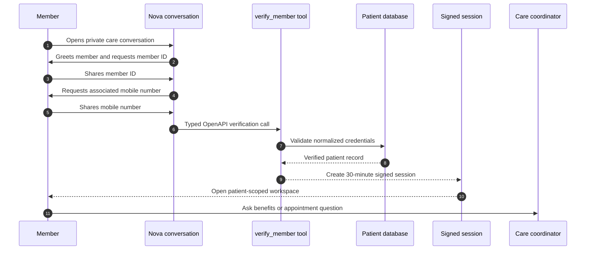
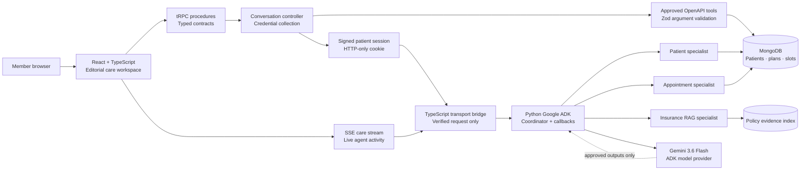

# NovaCorp Health Care Workspace

> **Private member access. Evidence-led coordination. Human-centred care.**

### Technology constellation

[](https://skillicons.dev)

[](https://trpc.io/)
[](https://www.mongodb.com/)
[](https://adk.dev/)
[](https://www.openapis.org/)
[](https://render.com/)

NovaCorp Health is an enterprise-ready member-care workspace. It pairs an **AI-led access conversation** with a persistent multi-patient data model, policy-evidence retrieval, confirmation-gated appointments, and a guarded **Python Google ADK** runtime. The product is designed so that the server—not the model or browser—owns verification, patient identity, data access, and consequential actions.

## Product at a glance

| Capability | What it delivers |
|---|---|
| **Conversation-first access** | Nova greets the member, requests a member ID, then asks for the associated mobile number. |
| **Patient-scoped session** | A signed, HTTP-only session is issued only after the backend verifies both credentials. |
| **ADK care coordination** | Python Google ADK invokes patient, evidence, availability, and summary callbacks for verified requests. |
| **Grounded coverage support** | Policy answers use retrieved evidence with document, section, page, and relevance details. |
| **Action safeguards** | Booking and cancellation need a separate, explicit confirmation before server execution. |
| **Stateless deployment** | Persistent data lives in MongoDB; request-scoped Python ADK sessions never become an authorization store. |
| **Voice session control** | Members can speak naturally, see Nova’s spoken messages in the transcript, and end a voice session without leaving microphone capture active. |
| **Healthcare-first interface** | Nova’s assistant surfaces use heart-pulse iconography rather than generic AI sparkle marks. |

---

## The member journey



> **Trust boundary:** Nova guides the conversation, but the server validates credentials and creates the session. Gemini never authenticates a member, chooses a patient, or directly executes an appointment action.

---

## System architecture



### Guardrails by design

| Boundary | Enforcement |
|---|---|
| **Identity** | The verified patient ID is resolved from the signed server session, never accepted from a model or action payload. |
| **Tool use** | Operations are allowlisted, described by OpenAPI 3.1, and validated with Zod before execution. |
| **Evidence** | A response selecting policy evidence must include matching citations; no-evidence requests produce no policy conclusion. |
| **Appointments** | A displayed slot does not create an appointment. The member must explicitly confirm before the server calls the booking operation. |
| **ADK callbacks** | Python `before_model` and `before_tool` callbacks require trusted patient state and reject non-allowlisted operations. |
| **Model output** | ADK responses are checked for citations, unsupported coverage language, diagnosis, and autonomous appointment claims before the member sees them. |

---

## Technology stack

| Layer | Technologies | Responsibility |
|---|---|---|
| **Experience** | React 19, TypeScript, Tailwind CSS, shadcn/ui | Responsive member conversation and care workspace. |
| **Application boundary** | Node.js, Express 4, tRPC 11 | Typed APIs, SSE activity events, signed-session validation, and a thin bridge to Python. |
| **Data** | MongoDB, MongoDB Node.js driver, PyMongo | Multi-patient records, medications, allergies, cited evidence, availability, and appointments. |
| **AI runtime** | Python 3, Google ADK, Gemini 3.6 Flash | ADK agent orchestration, typed Python function callbacks, and guarded response composition. |
| **Contracts** | OpenAPI 3.1, Zod | Documented operations and runtime validation. |
| **Deployment** | Docker, Render Blueprint, health endpoint, environment configuration | One stateless Node + Python service with persistent database backing. |

---

## Conversation and verification contract

Nova uses a deliberate two-step state machine. The sequence is predictable, inspectable, and easier to secure than interpreting a free-form identity statement.

```text
awaiting_member_id
        │ member ID captured
        ▼
awaiting_phone
        │ typed verify_member operation succeeds
        ▼
verified → signed session issued → workspace opens
```

The `verify_member` operation is included in the generated OpenAPI contract. It normalizes the member ID and mobile number, compares the server-side phone hash, returns a generic failure when validation does not succeed, and creates no patient session on its own. The conversation controller creates the session only after receiving a verified result.

---

## Quick start

### 1. Install and run

```bash
pnpm install
pnpm dev
```

### 2. Configure MongoDB and seed

```bash
# Configure MONGODB_URI in the server environment, then initialize indexes and showcase records.
pnpm seed:demo
```

### 3. Validate

```bash
pnpm test
pnpm check
pnpm build
```

## Showcase member credentials

> **Development and staging only.** Run `pnpm seed:demo` against a non-production MongoDB database before using these seeded records. Do not add these credentials or profiles to a production environment.

| Member | Member ID | Mobile number |
|---|---|---|
| Avery Carter | `NCG-48219` | `555-010-4821` |
| Maya Singh | `NCG-91577` | `555-010-9157` |
| Jordan Brooks | `NCS-76064` | `555-010-7606` |

### Seeded member scenarios and test requests

Each member has an active plan, patient-scoped profile data, and the same dual-verification flow. Enter the member ID first, then the associated mobile number. Nova normalizes spaces and hyphens, so spoken or typed values such as `NCG 48219` and `555 010 4821` are accepted for the matching showcase record.

| Verified member | Seeded care details | Representative questions and expected safe behavior |
|---|---|---|
| **Avery Carter** (`NCG-48219`) | **NovaCorp Gold Plus**; $55 specialist copay; $245 deductible remaining; Lisinopril 10 mg daily and Vitamin D3 1,000 IU daily; penicillin and shellfish allergies; scheduled primary-care visit with Dr. Elena Park on September 3 at 2:15 PM. | Ask **“What medicines and allergies are in my profile?”**, **“Show my upcoming appointment,”** **“Does my plan cover an orthopedic consultation?”**, or **“Find the earliest orthopedic appointment.”** Gold Plus orthopedic consultation answers cite the member handbook. A request to book an offered slot must open the separate confirmation step; no appointment is created from chat alone. |
| **Maya Singh** (`NCG-91577`) | **NovaCorp Gold Plus**; $35 specialist copay; $680 deductible remaining; Metformin 500 mg twice daily and Atorvastatin 20 mg nightly; latex allergy; scheduled cardiology visit with Dr. Theo Martin on September 5 at 11:00 AM. | Ask **“What is my specialist copay?”**, **“What appointments do I have?”**, **“Does my policy cover a knee replacement?”**, or **“Show cardiology availability.”** The joint-replacement question returns cited policy information and retains prior-authorization limits rather than claiming individual approval. |
| **Jordan Brooks** (`NCS-76064`) | **NovaCorp Silver Select**; $70 specialist copay; $910 deductible remaining; Albuterol as needed; sulfonamide allergy; no seeded future appointment. | Ask **“Show my profile,”** **“What is my specialist copay?”**, or **“Find dermatology availability.”** Then ask **“Does my plan cover an orthopedic consultation?”** to test the no-evidence guardrail: Nova must state that it cannot make a coverage claim without retrieved Silver Select policy evidence. |

Use these requests to verify the core safety path: **profile and appointment data remain scoped to the verified member; coverage responses include evidence citations when available; no diagnosis is provided; and booking or cancellation occurs only after an explicit confirmation in the typed server workflow.** You can end any test conversation with a natural closing phrase, such as “I do not need anything else” or “Have a good day,” to test the courteous signed-session closure.

## Voice experience and session ending

Nova’s visual identity uses **heart-pulse healthcare marks** in the assistant card, conversation timeline, empty states, and care-workspace runtime label. The symbols identify a health service without implying that the model is a clinical authority; the existing evidence, verification, and no-diagnosis safeguards remain the governing behavior.

When a member starts a voice conversation, Nova uses browser-native speech recognition where available, submits a completed utterance after a natural pause, and writes Nova’s spoken prompts and responses into the visible chat transcript. The interface shows browser support, selected fallback-transcription language, a recording countdown when the fallback path is used, and an accessible microphone-level meter while listening.

> **Session-ending guarantee:** On a confirmed spoken or typed care-session ending, the client immediately cancels native speech recognition, stops fallback recording and all microphone tracks, closes audio/meter resources, clears inactivity and resume timers, and prevents any deferred listening restart. The signed patient session is then closed by the server. No raw audio is retained by this application.

## Environment configuration

| Variable | Used for |
|---|---|
| `MONGODB_URI` | Server-only MongoDB or MongoDB Atlas connection URI. |
| `MONGODB_DATABASE` | Optional database name; defaults to `novacorp_healthcare`. |
| `JWT_SECRET` | Signing short-lived, verified patient sessions. |
| `GEMINI_API_KEY` | Server-only Gemini API access used by the Python ADK runtime. |
| `NOVACORP_ADK_MODEL` | Optional Python ADK Gemini model override; defaults to `gemini-3.6-flash`. |

Never commit environment values or expose them through client-side code.

## Deploy to Render

The included [`render.yaml`](render.yaml) configures a Docker-based, stateless Node + Python web service with the `/health` check. The root [`Dockerfile`](Dockerfile) installs the pinned Python ADK runtime, builds the React application, and starts the Node delivery process. Create a MongoDB Atlas deployment, configure the server-only values above, then run `pnpm seed:demo` once to create MongoDB indexes and the showcase records.

The project uses the official Python Google ADK agent runtime with function callbacks and lifecycle callbacks. [1] [2] [3]

## Project map

| Path | Purpose |
|---|---|
| `client/src/pages/Home.tsx` | Conversation-led member verification and patient workspace experience. |
| `server/novacorp/memberVerification.ts` | Verification conversation state machine and typed `verify_member` operation. |
| `server/novacorp/coordinator.ts` | Thin TypeScript transport bridge from the authenticated SSE route to Python. |
| `server/novacorp/adkRunner.ts` | Request-scoped Node-to-Python execution adapter and response-contract validation. |
| `python_adk/runner.py` | Official Python Google ADK agent, callback tools, grounded-output validation, and safe fallback. |
| `python_adk/data_service.py` | MongoDB-backed Python ADK callback data operations and index definitions. |
| `server/mongo.ts` | Server-only pooled MongoDB connection for deterministic verification and appointment confirmation. |
| `server/novacorp/tools.ts` | Patient-scoped approved operation dispatcher. |
| `server/novacorp/openapi.ts` | OpenAPI 3.1 contract and compatible model-tool definitions. |
| `docs/deployment.md` | External hosting, database, and Gemini deployment guide. |

## References

[1] [Google ADK — Python quickstart](https://adk.dev/get-started/python/)

[2] [Google ADK — function tools](https://adk.dev/tools-custom/function-tools/)

[3] [Google ADK — callbacks](https://adk.dev/callbacks/types-of-callbacks/)
